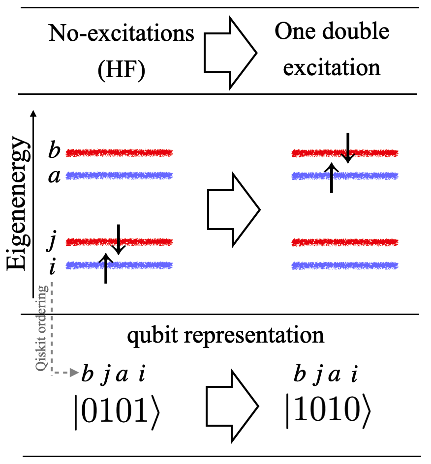

# Quantum Chemistry using Qiskit.

<p align="middle">

</p>

Chemistry methods such as Coupled Cluster, Configuration Interaction, Multi-configuration SCF, etc can yield energies values within *chemical accuracy* (errors ~ 0.1 kcal/mol ~ 0.004 eV); however, their computational cost is too expensive so that only small molecules (containing few tens of atoms) can be calculated with classical computers. Fortunately, these chemical calculations have been identified as the type of problem in which Quantum Computing could offer a definite advantage by reaching solutions in polynomial time instead of exponential time.

## 1. Ground-state energy of $H_2$: The role of the ansatz
The notebook linked here [h2.ipynb](http://nbviewer.org/github/luis-agapito/Qiskit_chemistry/blob/main/h2.ipynb?flush_cache=True) shows the workflow for calculating molecular energies with quantum computing using IBM's Qiskit programming framework.

We compare five different ansatzes and highlight the difference in cost and complexity between the popular Coupled-Cluster ansatzes and a simple and intuitive *ad hoc* ansatz. The latter considers one double excitation as the relevant mechanism that captures the chemistry of the system; despite its simplicity it outperforms the others in terms of accuracy, speed, number of layers and parameters in the circuits. 

<p align="middle">

</p>

To construct the *ad hoc* ansatz we implemented the quantum circuit proposed in Ref.[Anselmetti2021]. We also show a *heuristic* ansatz which exemplifies a research direction ([Kandala2017]) aiming at producing ansatzes without having domain-specific knowledge. The circuit is assembled by repeating predetermined architectures known to provide good sampling phase space (i.e. expressibility); this is especially needed for real-world applications in which coming up with physical intuition is not always possible.
<p align="middle">

</p>


## 2. How is the energy (expectation value) calculated?

The notebook linked here [h2_estimator.ipynb](http://nbviewer.org/github/luis-agapito/Qiskit_chemistry/blob/main/h2_estimator.ipynb?flush_cache=True) illustrates how expectation values are calculated in the framework of quantum computation.

Energy is the expectation value (braket) of the Hamiltonian operator: $E = \bra{\Psi} \hat{h} \ket{\Psi}$ . In classical computers, this braket is computed explicitly. In a quantum computer, however, it follows a different methodology, from which it stems the computational advantage over classical computing: the braket is estimated from statistical measurements performed on quantum circuits (a different circuit per Pauli string). 

$$  
\begin{align*}
E &= \bra{\Psi} \hat{h} \ket{\Psi} \\ 
  &=       -1.0523732 \bra{\Psi} \hat{I} \otimes \hat{I} \ket{\Psi} 
        +0.39793742 \bra{\Psi} \hat{I} \otimes \hat{Z} \ket{\Psi} 
         -0.3979374 \bra{\Psi} \hat{Z} \otimes \hat{I} \ket{\Psi}
         -0.0112801 \bra{\Psi} \hat{Z} \otimes \hat{Z} \ket{\Psi}
        +0.18093119 \bra{\Psi} \hat{X} \otimes \hat{X} \ket{\Psi} 
\end{align*}
$$ 

Each term is computed by summing the probabilities, $P$, obtained from measuring quantum circuits. In this notebook, we'll demonstrate the following identities

$$
\begin{gather*}
\bra{\Psi} \hat{I} \otimes \hat{I} \ket{\Psi} = P_{\ket{\Psi'}}(\ket{00}) + P_{\ket{\Psi'}}(\ket{01}) + P_{\ket{\Psi'}}(\ket{10}) + P_{\ket{\Psi'}}(\ket{11}) \\ 
\bra{\Psi} \hat{I} \otimes \hat{Z} \ket{\Psi} = P_{\ket{\Psi'}}(\ket{00}) - P_{\ket{\Psi'}}(\ket{01}) + P_{\ket{\Psi'}}(\ket{10}) - P_{\ket{\Psi'}}(\ket{11}) \\ 
\bra{\Psi} \hat{Z} \otimes \hat{I} \ket{\Psi} = P_{\ket{\Psi'}}(\ket{00}) + P_{\ket{\Psi'}}(\ket{01}) - P_{\ket{\Psi'}}(\ket{10}) - P_{\ket{\Psi'}}(\ket{11}) \\ 
\bra{\Psi} \hat{Z} \otimes \hat{Z} \ket{\Psi} = P_{\ket{\Psi'}}(\ket{00}) - P_{\ket{\Psi'}}(\ket{01}) - P_{\ket{\Psi'}}(\ket{10}) + P_{\ket{\Psi'}}(\ket{11}) \\ 
\bra{\Psi} \hat{X} \otimes \hat{X} \ket{\Psi} = P_{\ket{\Psi'}}(\ket{00}) - P_{\ket{\Psi'}}(\ket{01}) - P_{\ket{\Psi'}}(\ket{10}) + P_{\ket{\Psi'}}(\ket{11}) \\ 
\end{gather*}
$$

and use Qiskit to *manually* compute the energy. Finally, we'll compare against the results obtained using Qiskit's built-in class `Estimator()`. 

## References

- [Kandala2017] Hardware-efficient variational quantum eigensolver for small molecules and quantum magnets, Nature 549 (7671), 2017.
- [Anselmetti2021] Local, expressive, quantum-number-preserving VQE ansätze for fermionic systems, New Journal of Physics 23 (11), 2021.

 Qiskit is a rapidly evolving codebase; all code presented here has been tested with the last versions available as of November 2024.
```
notebook                          7.2.2
qiskit                            1.2.4
qiskit-aer                        0.15.1
qiskit-algorithms                 0.3.1
qiskit-nature                     0.7.2
Python 3.13.0
```

